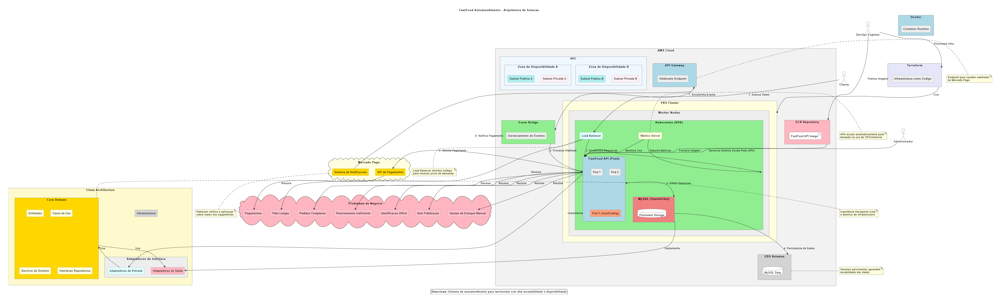

# FastFood Autoatendimento - Application

Este repositório contém **apenas a aplicação** do sistema backend para uma lanchonete com autoatendimento, utilizando TypeScript, Fastify, PrismaORM e MySQL, seguindo a arquitetura hexagonal (também conhecida como Ports and Adapters).

## 🏗️ **Arquitetura Desacoplada**

A infraestrutura foi desacoplada em repositórios separados:

- **[fast-food](https://github.com/laahundskarl/fast-food)** (este repositório) - Aplicação FastFood
- **[fast-food-k8s-infra](https://github.com/laahundskarl/fast-food-k8s-infra)** - Infraestrutura Kubernetes (EKS + ECR)
- **[fast-food-db-infra](https://github.com/laahundskarl/fast-food-db-infra)** - Infraestrutura Database (RDS MySQL)

### Pipeline CI/CD Automatizado

```
Database Infra → K8s Infra → Application Build → Deploy
```

1. **DB Infrastructure** deploys RDS MySQL
2. **K8s Infrastructure** deploys EKS cluster and ECR
3. **Application** builds and pushes Docker image
4. **Auto-deploy** triggers Kubernetes deployment

---

## Arquitetura da Solução



### Requisitos de Negócio

A solução resolve os seguintes problemas de negócio:

- **Gerenciamento de filas:** O sistema de autoatendimento reduz o tempo de espera dos clientes
- **Pedidos customizados:** Permite que clientes montem seus pedidos com facilidade
- **Rastreamento de pedidos:** Clientes podem acompanhar o status de preparação
- **Identificação simplificada:** Processo simples de identificação por CPF
- **Fidelização:** Registro de clientes para programas de fidelidade
- **Gestão de estoque:** Controle de produtos disponíveis em tempo real

### Requisitos de Infraestrutura

A arquitetura implementa:

- **Escalabilidade horizontal:** Uso de HPA (Horizontal Pod Autoscaler) para lidar com picos de demanda nos horários de maior movimento, garantindo que o totem não fique lento
- **Alta disponibilidade:** Múltiplas réplicas do serviço em diferentes zonas de disponibilidade
- **Persistência de dados:** Amazon RDS MySQL gerenciado
- **Balanceamento de carga:** LoadBalancer para distribuir requisições
- **Segurança:** Configurações de segurança e secrets no Kubernetes
- **Monitoramento:** Metrics Server para coleta de métricas de utilização
- **Infraestrutura como código:** Terraform para provisionamento da infraestrutura na AWS
- **Containerização:** Docker para empacotamento da aplicação
- **Orquestração:** Kubernetes para gerenciamento de containers e recursos

### Workflows CI/CD Implementadas

O projeto utiliza **GitHub Actions** com workflows padronizadas seguindo convenções de nomenclatura:

#### 📦 **fast-food** (este repositório)
- **`CI - Build and Test`** - Integração contínua com build, testes, lint e auditoria de segurança
- **`CD - Build and Deploy`** - Build da imagem Docker, push para ECR e trigger de deploy
- **`Cleanup - Application and Infrastructure`** - Limpeza granular (app-only) ou completa (full-infrastructure)

#### 🗄️ **fast-food-db-infra**
- **`Infrastructure - Validate Database`** - Validação Terraform do banco RDS MySQL
- **`Infrastructure - Deploy Database`** - Deploy automatizado da infraestrutura de banco
- **`Cleanup - Destroy Database`** - Destruição segura com backup automático

#### ☸️ **fast-food-k8s-infra**
- **`Infrastructure - Validate Kubernetes`** - Validação Terraform do cluster EKS
- **`Infrastructure - Deploy Kubernetes`** - Deploy do cluster EKS e configurações
- **`CD - Deploy Application`** - Deploy da aplicação no Kubernetes
- **`Cleanup - Destroy Kubernetes`** - Limpeza completa da infraestrutura K8s

---

## 📁 Estrutura do Projeto

```
api/                        → Coleções Postman para testes dos endpoints
docs/                       → Documentação, diagramas e convenções
src/
├── application/            → Camada de aplicação (casos de uso)
│   ├── services/           → Serviços de orquestração
│   └── use-cases/          → Implementação dos casos de uso
│       ├── client/         → Casos de uso para clientes
│       ├── identify/       → Casos de uso para identificação
│       ├── order/          → Casos de uso para pedidos
│       ├── payment/        → Casos de uso para pagamentos
│       ├── product/        → Casos de uso para produtos
│       ├── product-category/ → Casos de uso para categorias
│       └── webhook/        → Casos de uso para webhooks
│
├── domain/                 → Camada de domínio (entidades e regras de negócio)
│   ├── entities/           → Entidades de domínio
│   ├── gateways/           → Interfaces para serviços externos
│   ├── repositories/       → Interfaces dos repositórios
│   ├── services/           → Serviços de domínio
│   └── errors.ts           → Definição de erros de domínio
│
├── infrastructure/         → Camada de infraestrutura (implementações concretas)
│   ├── config/             → Configurações da aplicação
│   │   ├── container.ts    → Container de injeção de dependência
│   │   ├── env.ts          → Configurações de ambiente
│   │   └── types.ts        → Tipos para DI
│   ├── database/           → Configurações do banco de dados
│   │   └── prisma/         → Esquemas, migrações e seeds do Prisma
│   │       ├── migrations/ → Migrações do banco
│   │       ├── schema.prisma → Schema do banco de dados
│   │       └── seeds/      → Scripts para popular o banco
│   ├── gateways/           → Implementações de gateways externos
│   │   └── mercado-pago/   → Gateway do Mercado Pago
│   ├── repositories/       → Implementações dos repositórios
│   │   └── prisma/         → Repositórios usando Prisma
│   └── server/             → Configuração do servidor
│       ├── app.ts          → Configuração da aplicação Fastify
│       ├── server.ts       → Inicialização do servidor
│       └── @types/         → Tipos TypeScript customizados
│
├── interfaces/             → Camada de interface (controllers e HTTP)
│   ├── controller/         → Controladores HTTP
│   └── http/               → Configuração HTTP
│       ├── docs/           → Documentação Swagger
│       ├── middlewares/    → Middlewares HTTP
│       ├── routes/         → Definição das rotas
│       ├── schema/         → Esquemas de validação Zod
│       └── validator/      → Validadores customizados
│
└── index.ts                → Ponto de entrada da aplicação

### Arquivos de Configuração:
.github/workflows/          → CI/CD pipelines (CI, CD, Cleanup)
├── app-destroy.yml         → Workflow de cleanup da aplicação
├── build-push.yml          → Workflow de build e deploy
└── build-test.yml          → Workflow de CI com testes
.editorconfig               → Configuração do editor
.env                        → Variáveis de ambiente
.env.example                → Exemplo de variáveis de ambiente
.gitignore                  → Arquivos ignorados pelo Git
.prettierignore             → Arquivos ignorados pelo Prettier
.prettierrc                 → Configuração do Prettier
docker-compose.yml          → Configuração Docker para desenvolvimento
docker-compose.prod.yml     → Configuração Docker para produção
Dockerfile                  → Instruções para build da imagem Docker
eslint.config.mjs           → Configuração do ESLint
package.json                → Dependências e scripts do projeto
tsconfig.json               → Configuração do TypeScript
tsup.config.ts              → Configuração do bundler TSup
wait-for.sh                 → Script para aguardar serviços
```

---

## 🗄️ Modelo de Banco de Dados


### Configuração e Tecnologia

O banco de dados utilizado é o **Amazon RDS MySQL**, um serviço gerenciado que oferece alta disponibilidade, backups automáticos e escalabilidade. As entidades estão configuradas usando o **Prisma ORM** com migrations para versionamento do esquema do banco de dados.

**Comandos úteis do Prisma:**
```bash
npm run prisma:generate     # Gerar cliente Prisma
npm run prisma:migrate      # Aplicar migrações
npm run prisma:seed         # Popular com dados de teste
```

**Observação:** Para testes, ambos os ambientes (dev e prod) são populados automaticamente com dados de exemplo.

### Justificativa para Escolha do MySQL

A escolha do **MySQL** como banco de dados para o sistema FastFood foi baseada nos seguintes critérios técnicos e de negócio:

#### **1. Características do Domínio**
- **Dados estruturados:** O sistema trabalha com entidades bem definidas (Cliente, Pedido, Produto, Pagamento)
- **Relacionamentos claros:** Relacionamentos 1:N e N:N bem estabelecidos entre as entidades
- **Consistência ACID:** Transações financeiras (pagamentos) exigem consistência e atomicidade

#### **2. Vantagens Técnicas do MySQL**
- **Performance comprovada:** Excelente performance para operações OLTP (Online Transaction Processing)
- **Escalabilidade vertical:** Adequado para o volume esperado de uma lanchonete
- **Índices otimizados:** Suporte nativo a índices compostos para consultas complexas
- **JSON support:** Capacidade de armazenar dados semi-estruturados quando necessário

#### **3. Ecossistema e Operações**
- **Amazon RDS MySQL:** Gerenciamento automático, backups, patches e alta disponibilidade
- **Ferramentas maduras:** Vasto ecossistema de ferramentas de monitoramento e administração
- **Conhecimento da equipe:** Tecnologia amplamente conhecida, reduzindo curva de aprendizado
- **Custo-benefício:** Licença open-source com opções comerciais para suporte

#### **4. Requisitos do Sistema**
- **Transações financeiras:** ACID compliance essencial para integridade de pagamentos
- **Consultas relacionais:** Necessidade de JOINs para relatórios de pedidos e histórico
- **Backup e recuperação:** RDS oferece backup automatizado e point-in-time recovery
- **Compliance:** Suporte a auditoria para rastreabilidade de transações

**Conclusão:** MySQL oferece o equilíbrio ideal entre simplicidade operacional, performance, confiabilidade e custo para um sistema de autoatendimento FastFood.

---

## Event Storming (DDD)

As informações bem como a imagem do event storming estão disponibilizadas na pasta /docs da aplicação.
Maiores dúvidas acionar Willian Borba (Discord: willianrocha).

---

## ✅ Tecnologias Utilizadas

- Node.js com TypeScript
- Fastify como framework HTTP
- Prisma para ORM
- Amazon RDS MySQL como banco de dados
- Zod para validação de dados
- Docker & Docker Compose para conteinerização
- Swagger para documentação da API
- Arquitetura Hexagonal (Ports & Adapters)

---

## Recursos Implementados
- Cadastro e gerenciamento de clientes
- Identificação por CPF
- Gerenciamento de categorias de produtos
- Gerenciamento de produtos
- Criação e gerenciamento de pedidos
- Processamento de pagamentos
- API RESTful documentada
- Tratamento de erros padronizado
- Sistema de migração e seed de dados

---

## ⚙️ Como Rodar Localmente

### Pré-requisitos:
- Docker + Docker Compose

### Passos:
1. Clone o repositório:
   ```bash
   git clone https://github.com/laahundskarl/fast-food.git
   cd fast-food
   ```

2. Configure as variáveis de ambiente:
   ```markdown
   cp .env.example .env
   ```

3. Suba a aplicação com o docker:
   ```markdown
   docker-compose up --build (ambiente dev)
   docker compose -f docker-compose.prod.yml up --build (ambiente de prod)
   ```

4. Acesse a API no endereço:
   ```markdown
   http://localhost:3000
   ```

5. A documentação Swagger está disponível em:
   ```markdown
   http://localhost:3000/docs
   ```

---

## API Endpoints

### Cliente

- POST /client - Criar cliente
- GET /client/:cpf - Obter cliente por CPF
- PUT /client/:cpf - Atualizar cliente
- DELETE /client/:cpf - Excluir cliente

### Identificação

- POST /identify - Identificar cliente por CPF

### Produto

- GET /product - Listar produtos
- GET /product/:id - Obter produto por ID
- POST /product - Criar produto
- PUT /product/:id - Atualizar produto
- DELETE /product/:id - Excluir produto

### Categoria de Produto

- GET /product-category - Listar categorias de produtos
- GET /product-category/:id - Obter categoria por ID

### Pedidos

- GET /order - Listar pedidos
- GET /order/:id - Obter pedido por ID
- POST /order - Criar pedido
- PUT /order/:id - Atualizar pedido
- DELETE /order/:id - Excluir pedido

---

## Vídeo Fase 1 - Tech Challenge
[Disponível no Google Drive](https://drive.google.com/file/d/1g7Sn-VOfrwDRkErXO3EoisZLAg4psrhD/view)

## Vídeo Fase 2 - Tech Challenge
[Disponível no Google Drive](https://drive.google.com/file/d/1I3kuTuB8rHYfieVRkhryJwcm9AV9dKFI/view?usp=sharing)

## 🧑‍💻 Contribuidores

- Tech Challenge
    - RM 361923 - Leonardo Andreas - GitHub - laahundskarl - Discord - leooandreas
    - RM 361899 - Gabriel Gomes - GitHub - gabrielgsd1 - Discord - gabrielgsd
    - RM 364043 - Willian Borba - GitHub - WillianBorba - Discord - willianrocha
    - RM 362223 - Fabio Smaniotto - GitHub - fabiosb - Discord - ofabiosb

---

## 🚀 Deploy Automatizado na AWS

### 📋 **Deploy via GitHub Actions (Recomendado)**

O sistema utiliza **pipeline CI/CD automatizado** através de GitHub Actions:

1. **Push para `modulo_3`** no repositório `fast-food-db-infra` → Cria RDS MySQL
2. **Aguarda conclusão** → K8s infra detecta e cria EKS cluster automaticamente
3. **Push código** no repositório `fast-food` → Build e deploy da aplicação

**✅ Vantagens:**
- Deploy completamente automatizado
- Validações de segurança e qualidade
- Gestão de custos com cleanup sob demanda
- Zero configuração local necessária

### 🛠️ **Deploy Manual (Avançado)**

**Pré-requisitos:**

1. **AWS CLI configurado**
2. **Terraform >= 1.0 instalado**
3. **kubectl instalado**
4. **Docker instalado**
5. **Conta AWS com permissões para criar EKS, ECR, VPC, etc.**

### Passo 1: Configurar Credenciais AWS

#### AWS Academy:
```bash
# Baixar as credenciais do AWS Academy
# Criar arquivo ~/.aws/credentials
[default]
aws_access_key_id=YOUR_ACCESS_KEY
aws_secret_access_key=YOUR_SECRET_KEY
aws_session_token=YOUR_SESSION_TOKEN
region=us-east-1
```

#### AWS CLI padrão:
```bash
aws configure
# Inserir: Access Key, Secret Key, Region (us-east-1), Output format (json)
```

### Passo 2: Configurar Infraestrutura

**⚠️ IMPORTANTE:** A infraestrutura Terraform está nos repositórios separados:
- **Database:** [fast-food-db-infra](https://github.com/laahundskarl/fast-food-db-infra)
- **Kubernetes:** [fast-food-k8s-infra](https://github.com/laahundskarl/fast-food-k8s-infra)

```bash
# 1. Clone e configure os repositórios de infraestrutura separadamente
# 2. Deploy primeiro o banco de dados (fast-food-db-infra)
# 3. Deploy depois o Kubernetes (fast-food-k8s-infra)
# 4. Retorne para este repositório para build da aplicação
```

### Passo 3: Build e Push da Imagem Docker

```bash
# ECR URI será obtido dos outputs dos repositórios de infraestrutura
# Ou use as GitHub Actions que fazem isso automaticamente

# Para deploy manual, obtenha ECR URI dos repositórios de infraestrutura
ECR_URI="<ECR_URI_FROM_K8S_INFRA_REPO>"

# Extrair hostname do registry
ECR_REGISTRY=$(echo "$ECR_URI" | cut -d'/' -f1)
echo "ECR_REGISTRY: $ECR_REGISTRY"

# Login no ECR
aws ecr get-login-password --region us-east-1 | docker login --username AWS --password-stdin "$ECR_REGISTRY"

# Build da imagem
docker build -t fastfood-api .

# Tag da imagem
docker tag fastfood-api:latest "$ECR_URI:latest"

# Push para ECR
docker push "$ECR_URI:latest"
```

### Passo 4: Deploy da Aplicação no Kubernetes

**⚠️ IMPORTANTE:** Os manifests Kubernetes estão no repositório [fast-food-k8s-infra](https://github.com/laahundskarl/fast-food-k8s-infra).

```bash
# Para deploy manual:
# 1. Certifique-se que a infraestrutura K8s foi criada
# 2. Configure kubectl para o cluster EKS
aws eks update-kubeconfig --region us-east-1 --name fast-food-cluster-prd

# 3. A aplicação será deployada automaticamente via GitHub Actions
# Ou consulte o repositório fast-food-k8s-infra para deploy manual
```

### Passo 4: Verificar Deploy

```bash
# Verificar pods
kubectl get pods

# Verificar serviços
kubectl get svc

# Obter URL externa do LoadBalancer
kubectl get svc fastfood-loadbalancer

# Verificar HPA (pode demorar alguns minutos para mostrar métricas)
kubectl get hpa

# Verificar métricas dos pods
kubectl top pods

# Verificar métricas dos nodes
kubectl top nodes

# Ver logs da aplicação
kubectl logs -l app=fastfood-api -f
```

### Passo 6: Testar a Aplicação

```bash
# Port-forward para teste local (opcional)
kubectl port-forward svc/fastfood-api-service 8080:3000

# Acessar Swagger (se usando port-forward)
# http://localhost:8080/docs

### Troubleshooting

#### Verificar status dos pods:
```bash
kubectl get pods -o wide
kubectl describe pod <pod-name>
kubectl logs <pod-name> -c <container-name>
```

#### ⚠️ Problema comum: Metrics Server timeout (HPA não funciona)
Se `kubectl top nodes` mostrar `<unknown>` ou logs do Metrics Server mostrarem "context deadline exceeded":

```bash
# 1. Verificar se o security group permite comunicação na porta 10250
kubectl logs -n kube-system -l k8s-app=metrics-server --tail=20

# 2. Se houver erros de timeout, corrigir security group:
    NODE_SG=$(aws ec2 describe-security-groups \
      --filters "Name=group-name,Values=*node*" "Name=tag:kubernetes.io/cluster/fast-food-cluster-prd,Values=*" \
      --query 'SecurityGroups[0].GroupId' \
      --output text)

# 3. Adicionar regra de saída para kubelet metrics
aws ec2 authorize-security-group-egress \
  --group-id "$NODE_SG" \
  --protocol tcp \
  --port 10250 \
  --source-group "$NODE_SG"

# 4. Aguardar 2-3 minutos e testar
kubectl top nodes
```

### 💰 **Gestão de Custos e Cleanup**

⚠️ **IMPORTANTE**: Para evitar custos desnecessários, utilize as workflows de cleanup:

#### **Cleanup via GitHub Actions (Recomendado)**

**🔄 Cleanup Apenas da Aplicação** (mantém infraestrutura):
```
1. Vá para Actions no repositório fast-food
2. Execute "Cleanup - Application and Infrastructure"
3. Selecione "app-only" e digite "CLEANUP"
```

**🚨 Cleanup Completo** (destrói toda infraestrutura):
```
1. Vá para Actions no repositório fast-food
2. Execute "Cleanup - Application and Infrastructure"
3. Selecione "full-infrastructure" e digite "DESTROY"
```

**💡 Economia esperada:** ~$120-140/mês com cleanup completo

#### **Cleanup Manual** (caso necessário)
```bash
# 1. Remover aplicação Kubernetes (via repositório k8s-infra)
# Consulte: https://github.com/laahundskarl/fast-food-k8s-infra

# 2. Destruir infraestrutura (via repositórios separados)
# Database: https://github.com/laahundskarl/fast-food-db-infra
# K8s: https://github.com/laahundskarl/fast-food-k8s-infra

# 3. Ou use as workflows de cleanup via GitHub Actions (recomendado)
```

### Arquitetura do Deploy

```
┌─────────────────┐    ┌─────────────────┐    ┌─────────────────┐
│   LoadBalancer  │────│  FastFood API   │────│   Amazon RDS    │
│   (AWS ELB)     │    │   (2 replicas)  │    │     MySQL       │
└─────────────────┘    └─────────────────┘    └─────────────────┘
                                │                       │
                                │                       │
                          ┌─────────────────┐    ┌─────────────────┐
                          │   Kubernetes    │    │  Managed MySQL  │
                          │   (AWS EKS)     │    │                 │
                          └─────────────────┘    └─────────────────┘
```

### Recursos AWS Utilizados

- **EKS Cluster**: Kubernetes gerenciado
- **ECR Repository**: Registry de imagens Docker
- **RDS MySQL**: Banco de dados gerenciado
- **VPC + Subnets**: Rede isolada
- **IAM Roles**: Permissões de acesso
- **Security Groups**: Firewall
- **Load Balancer**: Acesso externo

**📝 Nota:** Para deploy completo, use as GitHub Actions ou consulte os repositórios de infraestrutura separados:
- **[fast-food-db-infra](https://github.com/laahundskarl/fast-food-db-infra)** - Database
- **[fast-food-k8s-infra](https://github.com/laahundskarl/fast-food-k8s-infra)** - Kubernetes
